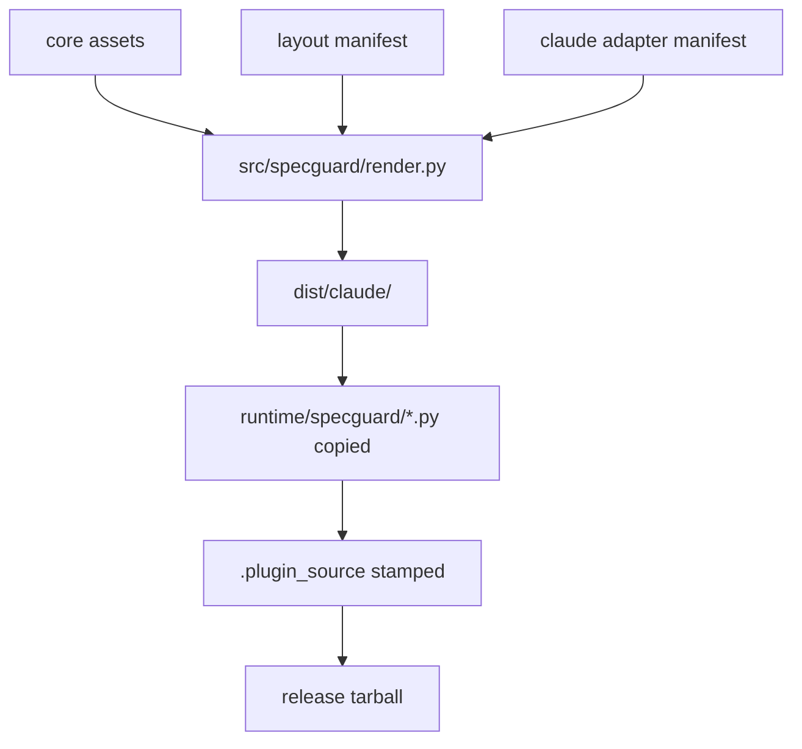

# specguard 设计（Living Architecture）

**Last verified against code**: 2026-05-01 @ commit `3eac728`
**Authoritative for**: 当前架构、命令语义、数据契约、安全边界
**ADR 索引**: [decisions/README.md](decisions/README.md)

> 本文档是 specguard 项目当前架构唯一真相。代码与本文档不一致即为缺陷。
> 决策动机与历史在 decisions/，本文档只反映“现在是什么”。

---

## 1. 产品定位与边界

specguard 是一个项目治理脚手架：把 living design、ADR、spec discipline、Claude hooks、slash commands 打包成可安装的 Claude Code plugin。

它的边界：
- 交付治理 scaffold，不接管用户项目的业务代码生成。
- 约束 AI 协作流程，不替代 OpenSpec、Superpowers、Spec Kit。
- 当前唯一可执行 agent adapter 是 Claude Code；Cursor、Codex、generic adapter 是 v0.3+ 留位。
- 当前唯一分发方式是 GitHub Release tarball；marketplace install 是 v0.3+ 留位。

## 2. 端到端流程

### 2.1 Build / Release flow



### 2.2 Init flow

```mermaid
flowchart TD
  A[/specguard:init] --> B[parse --ai / --spec / --dry-run]
  B --> C[confirm rendered layout paths]
  C --> D[create missing design / decisions / spec templates]
  C --> E[insert or replace CLAUDE.md specguard block]
  C --> F[write .specguard/hooks.snippet.json]
  F --> G[specguard.hooks_merge merges .claude/settings.json]
  G --> H[write .specguard-version]
```

### 2.3 Check flow

```mermaid
flowchart TD
  A[/specguard:check] --> B[read project governance files]
  B --> C[run 13 structural checks]
  C --> D{errors?}
  D -->|yes| E[print error report]
  D -->|no| F[print warning / success report]
  E --> G[no project writes]
  F --> G
```

### 2.4 Upgrade flow

```mermaid
flowchart TD
  A[/specguard:upgrade] --> B{.specguard-version exists?}
  B -->|no| C[stop: run /specguard:init first]
  B -->|yes| D[read CLAUDE_PLUGIN_ROOT/version]
  D --> E{same version?}
  E -->|yes| F[print already up to date]
  E -->|no| G[build replacements from embedded assets]
  G --> H[upgrade_project dry_run=True]
  H --> I[print diff_summary]
  I --> J{user confirms?}
  J -->|no| K[stop without writing]
  J -->|yes| L[upgrade_project dry_run=False]
```

## 3. 架构分层

### 3.1 core

`core/` 保存 agent-neutral、layout-neutral 治理资产：version、rules、templates、command prompts、policies。

### 3.2 layouts

`layouts/` 描述三种目录布局：`specguard-default`、`superpowers`、`openspec-sidecar`。layout 只声明路径与 policy 注入，不包含 agent runtime 逻辑。

### 3.3 adapters/claude

`adapters/claude/` 渲染 Claude Code plugin：plugin.json、design-governance skill、init/check/upgrade commands、hooks snippet。plugin name 固定为 `specguard`，没有 `commandNamespace` 字段，因此命令固定为 `/specguard:init`、`/specguard:check`、`/specguard:upgrade`（见 ADR-0001）。

### 3.4 src/specguard

`src/specguard/render.py` 是 build-time 渲染管线。`src/specguard/hooks_merge.py` 与 `src/specguard/upgrade.py` 是 runtime-safe Python modules，由 rendered prompts 通过 `CLAUDE_PLUGIN_ROOT/runtime` 导入（见 ADR-0004）。

## 4. 数据契约

执行强度分三类：

- **机器强制**：pytest、render、runtime module 或 hooks 能稳定执行。
- **治理强制**：`/specguard:check` 或 Claude prompt 明确检查并报告。
- **用户契约**：由文档和 ADR 约束，当前不自动执行。

| # | 契约 | 强度 | 当前语义 |
|---|---|---|---|
| 1 | `.specguard-version` | 机器强制 | TOML-like file，含 `specguard_version`、`agent`、`spec`、`layout`、`installed_at`、`plugin_source`。 |
| 2 | `.plugin_source` | 机器强制 | release tarball 写入 `github-release-v<version>`；本地 dist 缺失时 fallback 为 `local-dist`。 |
| 3 | `CLAUDE.md` specguard block | 机器强制 | 只替换 `<!-- specguard:start -->` 到 `<!-- specguard:end -->` 区域。 |
| 4 | decisions README rules marker | 机器强制 | 只替换 `<!-- specguard:rules:start -->` 到 `<!-- specguard:rules:end -->` 区域。 |
| 5 | `.claude/settings.json` hooks | 机器强制 | 按 `statusMessage` 前缀 `specguard:` 幂等替换 specguard hooks，保留非 specguard hooks。 |
| 6 | `.specguard/hooks.snippet.json` | 机器强制 | init 写入的 hook snippet source；check 要求存在。 |
| 7 | 禁止新 `*-design.md` | 机器强制 | hooks 阻止新 dated design 文件；superpowers 历史 `*-design.md` 为 warning。 |
| 8 | ADR 文件名 | 治理强制 | ADR 文件匹配 `^[0-9]{4}-[a-z0-9-]+\.md$`，README/TEMPLATE 例外。 |
| 9 | `docs/specguard/design.md` | 用户契约 | 当前架构唯一真相；接口、数据结构、模块边界变更必须同步。 |
| 10 | spec ADR 判断标题 | 治理强制 | 新 spec 必须含 `## ADR 级别决策识别`，存量文件可按 installed_at 豁免。 |
| 11 | ADR supersede 引用 | 治理强制 | `Superseded by ADR-NNNN` 的目标 ADR 必须存在。 |

## 5. 命令语义

### 5.1 通用规则

所有 `/specguard:*` 命令使用 rendered prompt 中的 embedded assets，不在用户项目运行时搜索 plugin 源码目录。需要 Python runtime 时，只能通过 `CLAUDE_PLUGIN_ROOT/runtime` 导入 bundled module。

### 5.2 `/specguard:init`

`/specguard:init` 解析 `--ai <claude|cursor|codex|generic|auto>`、`--spec <none|openspec|superpowers|auto>`、`--dry-run`。当前只有 Claude adapter 可执行；非 Claude 选项是未来 adapter 留位。init 创建缺失 scaffold、更新 CLAUDE.md marker block、写 hooks snippet、通过 `specguard.hooks_merge` 自动合并 hooks、写 `.specguard-version`。

### 5.3 `/specguard:check`

`/specguard:check` 是只读结构治理检查，运行 13 项 structural checks 并输出 error/warning/report。它不接受 `semantic` 模式，不创建 `.specguard/reviews/`，不生成 `prompt.md`、`context.md` 或 `findings-template.md`（见 ADR-0005）。

### 5.4 `/specguard:upgrade`

`/specguard:upgrade` 缺 `.specguard-version` 时停止并提示先运行 `/specguard:init`。版本相等时输出 `already up to date` 并退出。版本不同时先调用 `upgrade_project(..., dry_run=True)` 生成 diff summary，展示给用户并等待确认；确认后才调用 `upgrade_project(..., dry_run=False)` 写入（见 ADR-0006）。

### 5.5 prompt ↔ runtime Python API

`/specguard:init` prompt 依赖 `specguard.hooks_merge.merge_hooks_file()`。`/specguard:upgrade` prompt 依赖 `specguard.upgrade.upgrade_project()`、`UpgradeResult.diff_summary`、`UpgradeConflict.manual_patch`。

## 6. 不变量与安全边界

- marker 外永不修改：CLAUDE.md 与 decisions README 只改 specguard marker 内文本。
- `--dry-run` 与 `upgrade_project(..., dry_run=True)` 不写用户项目文件。
- upgrade 两阶段写入：所有 marker 校验与新内容构建成功后，才进入写入阶段。
- hooks 只按 `statusMessage` 前缀 `specguard:` 识别 specguard entries。
- release/runtime 边界：release tarball 必须携带 `runtime/specguard/` 与 `.plugin_source`。
- layout/adapter 边界：layout 不实现 agent 行为；adapter 不改变 layout paths。
- check 只读：`/specguard:check` 不创建 review package 或其他项目文件。
- specguard 不执行用户项目代码：render、hooks merge、upgrade 只读写治理文件与 JSON/TOML-like metadata。

## 7. 测试策略

### 7.1 风险 → 测试防线

| 风险 | 测试防线 |
|---|---|
| rendered command 残留 inject marker | `tests/test_render_claude_default.py` |
| hooks merge 覆盖用户自定义 hooks | `tests/test_init_merge_hooks.py` |
| upgrade conflict 后半写入 | `tests/test_dogfood_upgrade.py` |
| release tarball 缺 runtime 或 provenance | `tests/test_render_basic.py`、`tests/test_release_workflow.py` |
| layout path 漂移 | 三个 render layout 测试 |

### 7.2 改动类型 → 必跑测试

| 改动类型 | 必跑测试 |
|---|---|
| command prompt | `uv run pytest tests/test_render_claude_default.py -q` |
| hooks merge runtime | `uv run pytest tests/test_init_merge_hooks.py -q` |
| upgrade runtime | `uv run pytest tests/test_dogfood_upgrade.py -q` |
| render/release | `uv run pytest tests/test_render_basic.py tests/test_release_workflow.py -q` |
| release candidate | `uv run pytest` + render 三 layout |

### 7.3 必须人工 dogfood

- 新 release tarball：从 GitHub Release 下载后，在临时 git repo 运行 `/specguard:init`。
- upgrade 行为：在含旧 `.specguard-version` 的临时 repo 运行 `/specguard:upgrade`，确认 diff summary 与写入路径一致。
- hooks 行为：确认 `.claude/settings.json` 保留非 specguard hooks。

### 7.4 未覆盖风险

- Claude Code plugin runtime 对 `CLAUDE_PLUGIN_ROOT` 的暴露由 Claude Code 提供，pytest 只能覆盖 prompt 文案与本地 module 行为。
- 真 Claude 对话中的用户确认交互无法完全由 pytest 模拟，需要 dogfood。

## 8. 不在范围

### 8.1 v0.3+ 留位

- Cursor / Codex / generic adapter。
- Marketplace 分发。
- skill pressure tests。
- PR bot / GitHub Action 治理报告。
- 中央 dashboard。
- 多 agent adapter runtime。

### 8.2 已删除

- `/specguard:check semantic` review package 模式已删除（见 ADR-0005）。不再维护 `.specguard/reviews/`、`prompt.md`、`context.md`、`findings-template.md` 数据契约。
