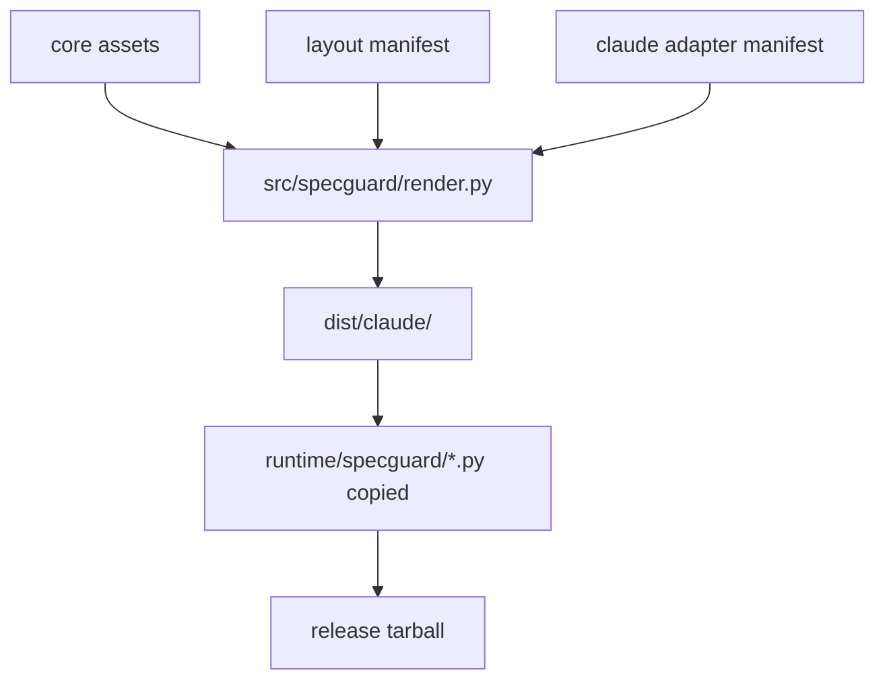

# specguard 设计（Living Architecture）

**Last verified against code**: 9bf394e
**Authoritative for**: 当前架构、命令语义、数据契约、安全边界
**ADR 索引**: [decisions/README.md](decisions/README.md)

> 本文档是 specguard 项目当前架构唯一真相。代码与本文档不一致即为缺陷。
> 决策动机与历史在 decisions/，本文档只反映“现在是什么”。

---

## 1. 产品定位与边界

specguard 是一个项目治理脚手架：把 living design、ADR、spec discipline、Claude hooks、slash commands 打包成可安装的 Claude Code plugin。

它的边界：
- 交付治理 scaffold，不接管用户项目的业务代码生成。
- 约束 AI 协作流程，不替代 OpenSpec、Superpowers、Spec Kit。
- 当前唯一可执行 agent adapter 是 Claude Code；Cursor、Codex、generic adapter 是 v0.3+ 留位。
- 当前唯一分发方式是 GitHub Release tarball；marketplace install 是 v0.3+ 留位。

## 2. 端到端流程

### 2.1 Build / Release flow



### 2.2 Init flow

```mermaid
flowchart TD
  A[/specguard:init] --> B[parse --ai / --spec / --dry-run]
  B --> C[confirm rendered layout paths]
  C --> D[create missing design / decisions / spec templates]
  C --> E[insert or replace CLAUDE.md specguard block]
  C --> F[write hooks snippet to tempfile]
  F --> G[specguard.hooks_merge merges .claude/settings.json]
```

### 2.3 Check flow

```mermaid
flowchart TD
  A[/specguard:check] --> B[read project governance files]
  B --> C[run 11 structural checks]
  C --> D{errors?}
  D -->|yes| E[print error report]
  D -->|no| F[print warning / success report]
  E --> G[no project writes]
  F --> G
```

## 3. 架构分层

### 3.1 core

`core/` 保存 agent-neutral、layout-neutral 治理资产：version、rules、templates、command prompts、policies。

### 3.2 layouts

`layouts/` 描述三种目录布局：`specguard-default`、`superpowers`、`openspec-sidecar`。layout 只声明路径与 policy 注入，不包含 agent runtime 逻辑。

### 3.3 adapters/claude

`adapters/claude/` 渲染 Claude Code plugin：plugin.json、design-governance skill、init/check commands、hooks snippet。plugin name 固定为 `specguard`，没有 `commandNamespace` 字段，因此命令固定为 `/specguard:init`、`/specguard:check`（见 ADR-0001）。

### 3.4 src/specguard

`src/specguard/render.py` 是 build-time 渲染管线，负责把 `src/specguard/` 下的 `__init__.py` 与 `hooks_merge.py` 复制到 dist 的 `runtime/specguard/`。`src/specguard/hooks_merge.py` 是 runtime-safe Python module，由 `/specguard:init` rendered prompt 通过 `CLAUDE_PLUGIN_ROOT/runtime` 导入（见 ADR-0004）。

## 4. 数据契约

执行强度分三类：

- **机器强制**：pytest、render、runtime module 或 hooks 能稳定执行。
- **治理强制**：`/specguard:check` 或 Claude prompt 明确检查并报告。
- **用户契约**：由文档和 ADR 约束，当前不自动执行。

| # | 契约 | 强度 | 当前语义 |
|---|---|---|---|
| 1 | `CLAUDE.md` specguard block | 机器强制 | 只替换 `<!-- specguard:start -->` 到 `<!-- specguard:end -->` 区域。 |
| 2 | `.claude/settings.json` hooks | 机器强制 | 按 `statusMessage` 前缀 `specguard:` 幂等替换 specguard hooks，保留非 specguard hooks。 |
| 3 | 禁止新 `*-design.md` | 机器强制 | hooks 阻止新 dated design 文件；superpowers 历史 `*-design.md` 为 warning。 |
| 4 | ADR 文件名 | 治理强制 | ADR 文件匹配 `^[0-9]{4}-[a-z0-9-]+\.md$`，README/TEMPLATE 例外。 |
| 5 | `docs/specguard/design.md` | 用户契约 | 当前架构唯一真相；接口、数据结构、模块边界变更必须同步。 |
| 6 | spec ADR 判断标题 | 治理强制 | 新 spec 必须含 `## ADR 级别决策识别`，存量文件可按 installed_at 豁免。 |
| 7 | ADR supersede 引用 | 治理强制 | `Superseded by ADR-NNNN` 的目标 ADR 必须存在。 |

## 5. 命令语义

### 5.1 通用规则

所有 `/specguard:*` 命令使用 rendered prompt 中的 embedded assets，不在用户项目运行时搜索 plugin 源码目录。需要 Python runtime 时，只能通过 `CLAUDE_PLUGIN_ROOT/runtime` 导入 bundled module。

### 5.2 `/specguard:init`

`/specguard:init` 解析 `--ai <claude|cursor|codex|generic|auto>`、`--spec <none|openspec|superpowers|auto>`、`--dry-run`。当前只有 Claude adapter 可执行；非 Claude 选项是未来 adapter 留位。init 创建缺失 scaffold、更新 CLAUDE.md marker block、用 tempfile + `specguard.hooks_merge` 合并 hooks 到 `.claude/settings.json`。

### 5.3 `/specguard:check`

`/specguard:check` 是只读结构治理检查，运行 11 项 structural checks 并输出 error/warning/report。它不接受 `semantic` 模式，不创建 `.specguard/reviews/`，不生成 `prompt.md`、`context.md` 或 `findings-template.md`（见 ADR-0005）。

### 5.4 prompt ↔ runtime Python API

`/specguard:init` prompt 依赖 `specguard.hooks_merge.merge_hooks_file()`。

## 6. 不变量与安全边界

- marker 外永不修改：CLAUDE.md 与 decisions README 只改 specguard marker 内文本。
- `--dry-run` 不写用户项目文件。
- hooks 只按 `statusMessage` 前缀 `specguard:` 识别 specguard entries。
- release/runtime 边界：release tarball 必须携带 `runtime/specguard/`。
- layout/adapter 边界：layout 不实现 agent 行为；adapter 不改变 layout paths。
- check 只读：`/specguard:check` 不创建 review package 或其他项目文件。
- specguard 不执行用户项目代码：render、hooks merge 只读写治理文件与 JSON/TOML-like metadata。

## 7. 测试策略

### 7.1 风险 → 测试防线

| 风险 | 测试防线 |
|---|---|
| rendered command 残留 inject marker | `tests/test_render_claude_default.py` |
| hooks merge 覆盖用户自定义 hooks | `tests/test_init_merge_hooks.py` |
| release tarball 缺 runtime | `tests/test_render_basic.py`、`tests/test_release_workflow.py` |
| layout path 漂移 | 三个 render layout 测试 |

### 7.2 改动类型 → 必跑测试

| 改动类型 | 必跑测试 |
|---|---|
| command prompt | `uv run pytest tests/test_render_claude_default.py -q` |
| hooks merge runtime | `uv run pytest tests/test_init_merge_hooks.py -q` |
| render/release | `uv run pytest tests/test_render_basic.py tests/test_release_workflow.py -q` |
| release candidate | `uv run pytest` + render 三 layout |

### 7.3 必须人工 dogfood

- 新 release tarball：从 GitHub Release 下载后，在临时 git repo 运行 `/specguard:init`。
- hooks 行为：确认 `.claude/settings.json` 保留非 specguard hooks。
- v0.3.0 dogfood 记录（2026-05-01，commit 9bf394e，release v0.3.0）：在 `/tmp/sg-dog-v030/<layout>/repo` 三个临时 git repo 各跑一次 `/specguard:init --ai claude --spec none` 与 `/specguard:check`。三 layout（specguard-default / superpowers / openspec-sidecar）init 全部成功创建治理文件并自动合并 hooks；check 输出 11 项结构检查，0 errors / 0 warnings。Tarball 验证：commands 仅含 `init.md` + `check.md`，runtime 仅含 `__init__.py` + `hooks_merge.py`，无 `.plugin_source`、`.specguard-version`、`.specguard/hooks.snippet.json`、decisions/README rules marker。

### 7.4 未覆盖风险

- Claude Code plugin runtime 对 `CLAUDE_PLUGIN_ROOT` 的暴露由 Claude Code 提供，pytest 只能覆盖 prompt 文案与本地 module 行为。
- 真 Claude 对话中的用户确认交互无法完全由 pytest 模拟，需要 dogfood。

## 8. 不在范围

### 8.1 v0.3+ 留位

- Cursor / Codex / generic adapter。
- Marketplace 分发。
- skill pressure tests。
- PR bot / GitHub Action 治理报告。
- 中央 dashboard。
- 多 agent adapter runtime。
- upgrade 命令（如未来出现真实跨版本升级痛点重新立 ADR）。

### 8.2 已删除

- `/specguard:check semantic` review package 模式已删除（见 ADR-0005）。不再维护 `.specguard/reviews/`、`prompt.md`、`context.md`、`findings-template.md` 数据契约。
- `/specguard:upgrade` 命令及相关伪契约已撤回（见 ADR-0007）。不再维护 `.specguard-version`、`.plugin_source`、decisions/README rules marker (`specguard:rules:start/end`)、`.specguard/hooks.snippet.json` 数据契约；`/specguard:check` 不再执行原第 11/12/13 项检查。
