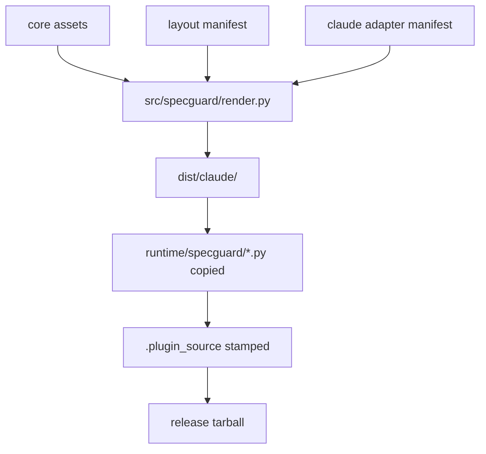

# Design Doc Restructure and v0.1 Cleanup Implementation Plan

> **For agentic workers:** REQUIRED SUB-SKILL: Use superpowers:subagent-driven-development (recommended) or superpowers:executing-plans to implement this plan task-by-task. Steps use checkbox (`- [ ]`) syntax for tracking.

**Goal:** Ship the v0.2.1 cleanup slice: make `design.md` an AI-collaboration-first living architecture document, remove the v0.1 semantic review package residue, and tighten `/specguard:upgrade` into a confirm-before-write flow.

**Architecture:** Keep prompts thin and move write-sensitive behavior into the tested Python runtime. `core/command-prompts/*.md` defines slash-command semantics, `src/specguard/upgrade.py` owns diff/dry-run/write behavior, rendered command tests lock prompt content, and `docs/specguard/design.md` remains the single current truth.

**Tech Stack:** Python 3.11+, stdlib `json`/`difflib`/`pathlib`, existing Jinja render pipeline, pytest, Markdown, Mermaid.

---

## File Structure

- Create `docs/specguard/decisions/0005-delete-check-semantic-review-package.md`: ADR for deleting `/specguard:check semantic` review package mode.
- Create `docs/specguard/decisions/0006-tighten-upgrade-interaction-and-version-handling.md`: ADR for missing-version stop, dry-run diff summary, and confirm-before-write upgrade semantics.
- Modify `docs/specguard/decisions/README.md`: add ADR-0005 and ADR-0006 rows.
- Modify `core/command-prompts/check.md`: remove semantic argument/mode, keep check read-only, update missing-hooks error wording.
- Modify `core/command-prompts/init.md`: replace the embedded hooks section wording so hooks are described as auto-merged via `specguard.hooks_merge`.
- Modify `core/command-prompts/upgrade.md`: stop on missing `.specguard-version`, compare `${CLAUDE_PLUGIN_ROOT}/version`, run `upgrade_project(..., dry_run=True)` first, show diff summary, wait for confirmation, then write.
- Modify `src/specguard/upgrade.py`: add `dry_run: bool = False`, add `diff_summary: str` to `UpgradeResult`, and return the summary without writing when `dry_run=True`.
- Modify `tests/test_dogfood_upgrade.py`: add dry-run and diff-summary coverage while preserving existing write-path tests.
- Modify `tests/test_render_claude_default.py`: add rendered prompt assertions for semantic deletion, init wording, check error wording, and upgrade diff/confirm semantics.
- Modify `README.md`: replace `git clone <this repo>` with `git clone https://github.com/saberhaha/specguard.git`.
- Modify `CHANGELOG.md`: add `Unreleased` section describing semantic removal and upgrade interaction tightening.
- Modify `docs/specguard/design.md`: rewrite into 8 sections with 4 Mermaid diagrams, 11 data contracts, command semantics, invariants, risk-driven test strategy, and v0.3+ out-of-scope list.

---

### Task 1: ADR-0005 / ADR-0006 and Decisions Index

**Files:**
- Create: `docs/specguard/decisions/0005-delete-check-semantic-review-package.md`
- Create: `docs/specguard/decisions/0006-tighten-upgrade-interaction-and-version-handling.md`
- Modify: `docs/specguard/decisions/README.md`

- [ ] **Step 1: Create ADR-0005**

Write `docs/specguard/decisions/0005-delete-check-semantic-review-package.md`:

```markdown
# ADR 0005: 删除 `/specguard:check semantic` review package 模式

**状态**：Accepted
**日期**：2026-05-01
**拍板者**：用户（@saber，对话日期 2026-05-01，确认删除 v0.1 semantic review package 残留）
**取代**：—
**相关**：[design.md §5.3 / §8](../design.md) / spec [design-doc-restructure-and-v0-1-cleanup-spec.md](../specs/design-doc-restructure-and-v0-1-cleanup-spec.md)

## Context

v0.1 的 `/specguard:check semantic` 会生成 `.specguard/reviews/<UTC>/`，其中包含给另一个 LLM 使用的 `prompt.md`、`context.md`、`findings-template.md`。这来自早期工具型心智：把 semantic review 当成离线 review package 生成器。

现在 `/specguard:check` 本身就是 Claude Code slash command，运行环境已经是 LLM 对话。继续生成另一个 LLM 的 prompt/context/findings-template 会让命令边界变复杂，也会误导用户以为 specguard 有单独的 LLM review 子系统。

## Decision

删除 `/specguard:check semantic` review package 模式。

`/specguard:check` 在 v0.2.1 起只表达结构治理检查：读取当前项目文件、输出 error/warning/report，不创建 `.specguard/reviews/`，不生成 `prompt.md` / `context.md` / `findings-template.md`。

未来如果需要语义审查，应在 `/specguard:check` 的当前 Claude 对话内直接输出 findings，而不是恢复 review package 目录。

## Consequences

- **正面**：
  - `/specguard:check` 的用户心智收敛为只读治理检查。
  - 删除 v0.1 残留的数据契约，避免 `.specguard/reviews/` 被误认为稳定产物。
  - design.md 不再描述未被当前产品定位支持的 review package。
- **负面**：
  - 已经依赖 `.specguard/reviews/` 离线包的用户需要改为在当前 Claude 对话中请求语义 review。
- **同步更新**：
  - `core/command-prompts/check.md` 删除 `semantic` 参数与 Semantic mode 小节。
  - `docs/specguard/design.md` §5 / §8 记录该模式已删除。
  - `tests/test_render_claude_default.py` 断言 rendered `commands/check.md` 不含 semantic review package 文案。
```

- [ ] **Step 2: Create ADR-0006**

Write `docs/specguard/decisions/0006-tighten-upgrade-interaction-and-version-handling.md`:

```markdown
# ADR 0006: 收紧 `/specguard:upgrade` 写入前交互与缺版本行为

**状态**：Accepted
**日期**：2026-05-01
**拍板者**：用户（@saber，对话日期 2026-05-01，确认 upgrade 必须先展示 diff summary 并等待确认）
**取代**：—
**相关**：[design.md §5.4 / §6](../design.md) / spec [design-doc-restructure-and-v0-1-cleanup-spec.md](../specs/design-doc-restructure-and-v0-1-cleanup-spec.md)

## Context

`/specguard:upgrade` 会修改已经存在的用户项目文件，包括 `CLAUDE.md` marker block、`.claude/settings.json` 中 specguard hooks、两个 `TEMPLATE.md`、`decisions/README.md` rules marker block 和 `.specguard-version`。

这些文件属于用户项目治理入口。upgrade 如果在缺 `.specguard-version` 时复合执行 init-then-upgrade，或者在未展示差异前直接写入，会扩大命令副作用并削弱用户对写入范围的判断。

## Decision

收紧 `/specguard:upgrade` 的运行语义：

1. 缺 `.specguard-version` 时立即停止，提示用户先运行 `/specguard:init`；不在 upgrade 内执行 init-then-upgrade 复合流程。
2. 先解析 `CLAUDE_PLUGIN_ROOT` 并读取 `${CLAUDE_PLUGIN_ROOT}/version`，再与 `.specguard-version` 的 `specguard_version` 比较。
3. 版本相等时输出 `already up to date` 并退出，不执行写入。
4. 版本不同时先调用 `upgrade_project(Path("."), replacements, dry_run=True)`，展示 `UpgradeResult.diff_summary`，等待用户明确确认。
5. 用户确认后再调用 `upgrade_project(Path("."), replacements, dry_run=False)` 执行写入。

## Consequences

- **正面**：
  - upgrade 的写入边界可预测，符合“写入前展示 diff summary”的用户契约。
  - 缺版本文件被明确视为未初始化状态，避免 upgrade 偷偷承担 init 职责。
  - prompt 与 runtime API 形成明确依赖：prompt 依赖 `UpgradeResult.diff_summary` 和 `dry_run=True` 不写文件语义。
- **负面**：
  - prompt 与 `src/specguard/upgrade.py` 的 API 耦合更强；rendered command 测试必须覆盖该耦合。
  - 用户从未初始化项目升级时需要先运行一次 `/specguard:init`。
- **同步更新**：
  - `src/specguard/upgrade.py` 增加 `dry_run` 参数与 diff summary 返回值。
  - `core/command-prompts/upgrade.md` 落实 missing-version stop、already-up-to-date short-circuit、dry-run summary、confirm-before-write。
  - `tests/test_dogfood_upgrade.py` 覆盖 dry-run 不写文件与 diff summary。
  - `tests/test_render_claude_default.py` 覆盖 rendered upgrade prompt 语义。
```

- [ ] **Step 3: Update ADR index**

Modify the table in `docs/specguard/decisions/README.md` so it contains these two rows after ADR-0004:

```markdown
| [0005](0005-delete-check-semantic-review-package.md) | 删除 `/specguard:check semantic` review package 模式 | Accepted | design §5.3、§8 |
| [0006](0006-tighten-upgrade-interaction-and-version-handling.md) | 收紧 `/specguard:upgrade` 写入前交互与缺版本行为 | Accepted | design §5.4、§6 |
```

- [ ] **Step 4: Verify ADR files and index links**

Run:

```bash
ls docs/specguard/decisions/0005-delete-check-semantic-review-package.md docs/specguard/decisions/0006-tighten-upgrade-interaction-and-version-handling.md
python - <<'PY'
from pathlib import Path
index = Path('docs/specguard/decisions/README.md').read_text(encoding='utf-8')
assert '0005-delete-check-semantic-review-package.md' in index
assert '0006-tighten-upgrade-interaction-and-version-handling.md' in index
print('ADR index ok')
PY
```

Expected output includes:

```text
ADR index ok
```

- [ ] **Step 5: Commit Task 1**

```bash
git add docs/specguard/decisions/0005-delete-check-semantic-review-package.md docs/specguard/decisions/0006-tighten-upgrade-interaction-and-version-handling.md docs/specguard/decisions/README.md
git commit -m "docs: record v0.2.1 cleanup ADRs"
```

---

### Task 2: Rendered Prompt Tests for Cleanup Semantics

**Files:**
- Modify: `tests/test_render_claude_default.py`

- [ ] **Step 1: Add failing tests for check/init/upgrade prompt semantics**

Append these tests to `tests/test_render_claude_default.py`:

```python

def test_check_command_removes_semantic_review_package(dist: Path):
    cmd = (dist / "commands/check.md").read_text(encoding="utf-8")
    assert "Optional positional: `semantic`" not in cmd
    assert "## Semantic mode" not in cmd
    assert ".specguard/reviews" not in cmd
    assert "findings-template" not in cmd
    assert "Do NOT call any LLM" not in cmd


def test_check_command_prefers_init_for_missing_hooks(dist: Path):
    cmd = (dist / "commands/check.md").read_text(encoding="utf-8")
    assert "missing specguard hooks" in cmd
    assert "run `/specguard:init` to auto-merge" in cmd
    assert "manually merge `.specguard/hooks.snippet.json`" in cmd
    assert cmd.index("run `/specguard:init` to auto-merge") < cmd.index("manually merge `.specguard/hooks.snippet.json`")


def test_init_command_hooks_section_describes_auto_merge(dist: Path):
    cmd = (dist / "commands/init.md").read_text(encoding="utf-8")
    assert "auto-merged into `.claude/settings.json` via `specguard.hooks_merge`" in cmd
    assert "then manually merge into `.claude/settings.json`" not in cmd


def test_upgrade_command_requires_version_and_confirmed_diff(dist: Path):
    cmd = (dist / "commands/upgrade.md").read_text(encoding="utf-8")
    assert "If `.specguard-version` is missing, stop" in cmd
    assert "run `/specguard:init` first" in cmd
    assert "Do not run init-then-upgrade" in cmd
    assert 'plugin_root / "version"' in cmd
    assert "already up to date" in cmd
    assert "dry_run=True" in cmd
    assert "diff_summary" in cmd
    assert "Ask user to confirm" in cmd
    assert "dry_run=False" in cmd
```

- [ ] **Step 2: Run prompt tests and verify failure**

Run:

```bash
uv run pytest tests/test_render_claude_default.py -q
```

Expected: at least the new semantic/init/upgrade assertions fail because current prompts still include semantic mode, the old init embedded wording, and no dry-run upgrade flow.

- [ ] **Step 3: Commit failing tests**

```bash
git add tests/test_render_claude_default.py
git commit -m "test: pin v0.2.1 prompt cleanup semantics"
```

---

### Task 3: Remove Check Semantic Mode and Fix Init/Check Prompt Wording

**Files:**
- Modify: `core/command-prompts/check.md`
- Modify: `core/command-prompts/init.md`

- [ ] **Step 1: Edit `core/command-prompts/check.md` arguments**

Replace the Arguments section with:

```markdown
## Arguments

User-provided: $ARGUMENTS
No positional modes are supported. This command is read-only and does not create review packages or other project files.
```

- [ ] **Step 2: Edit `core/command-prompts/check.md` structural check 12**

Ensure item 12 is exactly:

```markdown
12. `.claude/settings.json` must contain entries tagged with `statusMessage` prefix `specguard:`. If missing specguard hooks are detected, report this as an **error** (not a warning); include the exact message: "missing specguard hooks — run `/specguard:init` to auto-merge, or manually merge `.specguard/hooks.snippet.json` into `.claude/settings.json` as a fallback".
```

- [ ] **Step 3: Delete the Semantic mode section**

Remove this entire block from `core/command-prompts/check.md`:

```markdown
## Semantic mode

If argument `semantic` is provided, additionally:
1. Create `.specguard/reviews/<UTC YYYYMMDD-HHMM>/`
2. Write `prompt.md`: instructions for an LLM to review ADR Context plausibility, missed ADR judgement, design.md drift.
3. Write `context.md`: assembled excerpts from design.md, decisions index, latest spec, latest plan.
4. Write `findings-template.md`: structured output format for the LLM.
5. Do NOT call any LLM. Tell the user to feed `prompt.md + context.md` to Claude Code / Cursor / any LLM.
```

- [ ] **Step 4: Edit `core/command-prompts/init.md` hooks embedded section wording**

Replace the sentence under `## Embedded asset: hooks settings.json snippet` with:

```markdown
This is the verbatim JSON to write to `.specguard/hooks.snippet.json`; `/specguard:init` then auto-merges it into `.claude/settings.json` via `specguard.hooks_merge`.
```

- [ ] **Step 5: Run prompt tests**

Run:

```bash
uv run pytest tests/test_render_claude_default.py -q
```

Expected: semantic deletion, init wording, and check missing-hooks wording tests pass. Upgrade prompt test still fails until Task 5.

- [ ] **Step 6: Commit Task 3**

```bash
git add core/command-prompts/check.md core/command-prompts/init.md
git commit -m "fix: remove check semantic mode and clarify hook merge guidance"
```

---

### Task 4: Upgrade Runtime Dry-Run and Diff Summary

**Files:**
- Modify: `tests/test_dogfood_upgrade.py`
- Modify: `src/specguard/upgrade.py`

- [ ] **Step 1: Add failing dry-run tests**

Append these tests to `tests/test_dogfood_upgrade.py`:

```python

def test_upgrade_dry_run_returns_diff_summary_without_writing(tmp_path: Path):
    setup_project(tmp_path)
    before = {
        p: p.read_text(encoding="utf-8")
        for p in [
            tmp_path / "CLAUDE.md",
            tmp_path / ".claude/settings.json",
            tmp_path / "docs/specguard/specs/TEMPLATE.md",
            tmp_path / "docs/specguard/decisions/TEMPLATE.md",
            tmp_path / "docs/specguard/decisions/README.md",
            tmp_path / ".specguard-version",
        ]
    }

    result = upgrade_project(tmp_path, replacements(), dry_run=True)

    assert result.changed is True
    assert "SpecGuard upgrade 0.1.0 → 0.2.0" in result.diff_summary
    assert "Will update:" in result.diff_summary
    assert "CLAUDE.md specguard block" in result.diff_summary
    assert ".claude/settings.json specguard hooks" in result.diff_summary
    assert "docs/specguard/specs/TEMPLATE.md" in result.diff_summary
    assert "docs/specguard/decisions/TEMPLATE.md" in result.diff_summary
    assert "docs/specguard/decisions/README.md rules" in result.diff_summary
    assert ".specguard-version" in result.diff_summary
    assert "Will not touch:" in result.diff_summary
    assert "docs/specguard/design.md content" in result.diff_summary
    assert "existing ADR files" in result.diff_summary
    assert "existing spec files" in result.diff_summary
    assert {p: p.read_text(encoding="utf-8") for p in before} == before


def test_upgrade_dry_run_no_op_summary_when_already_current(tmp_path: Path):
    setup_project(tmp_path)
    upgrade_project(tmp_path, replacements())

    result = upgrade_project(tmp_path, replacements(), dry_run=True)

    assert result.changed is False
    assert "SpecGuard upgrade 0.2.0 → 0.2.0" in result.diff_summary
    assert "No changes required." in result.diff_summary
```

- [ ] **Step 2: Run dogfood upgrade tests and verify failure**

Run:

```bash
uv run pytest tests/test_dogfood_upgrade.py -q
```

Expected: the new tests fail with `TypeError: upgrade_project() got an unexpected keyword argument 'dry_run'` or `UpgradeResult` missing `diff_summary`.

- [ ] **Step 3: Update `UpgradeResult` and `upgrade_project` signature**

In `src/specguard/upgrade.py`, replace the dataclass and function signature with:

```python
@dataclass(frozen=True)
class UpgradeResult:
    changed: bool
    diff_summary: str


def upgrade_project(root: Path, replacements: dict[str, Any], dry_run: bool = False) -> UpgradeResult:
```

- [ ] **Step 4: Add summary helpers to `src/specguard/upgrade.py`**

Add these helpers below `_update_version_file`:

```python

def _read_installed_version(text: str) -> str:
    for line in text.splitlines():
        match = re.match(r'^specguard_version\s*=\s*["\']([^"\']+)["\']', line)
        if match:
            return match.group(1)
    return "unknown"


def _build_diff_summary(old_version: str, new_version: str, changed_regions: list[str]) -> str:
    lines = [f"SpecGuard upgrade {old_version} → {new_version}", ""]
    if changed_regions:
        lines.append("Will update:")
        lines.extend(f"✓ {region}" for region in changed_regions)
    else:
        lines.append("No changes required.")
    lines.extend(
        [
            "",
            "Will not touch:",
            "- docs/specguard/design.md content",
            "- existing ADR files",
            "- existing spec files",
        ]
    )
    return "\n".join(lines) + "\n"
```

- [ ] **Step 5: Compute changed regions before writing**

In `upgrade_project`, after `changed = (...)`, add:

```python
    old_version = _read_installed_version(version_original)
    changed_regions: list[str] = []
    if claude_new != claude_original:
        changed_regions.append("CLAUDE.md specguard block")
    if settings_new != settings_current:
        changed_regions.append(".claude/settings.json specguard hooks")
    if specs_template_new != specs_current:
        changed_regions.append("docs/specguard/specs/TEMPLATE.md")
    if decisions_template_new != decisions_template_current:
        changed_regions.append("docs/specguard/decisions/TEMPLATE.md")
    if decisions_readme_new != decisions_readme_original:
        changed_regions.append("docs/specguard/decisions/README.md rules")
    if version_new != version_original:
        changed_regions.append(".specguard-version")
    diff_summary = _build_diff_summary(old_version, replacements["version"], changed_regions)

    if dry_run:
        return UpgradeResult(changed=changed, diff_summary=diff_summary)
```

- [ ] **Step 6: Return diff summary on write path**

Replace the final return with:

```python
    return UpgradeResult(changed=changed, diff_summary=diff_summary)
```

- [ ] **Step 7: Run dogfood upgrade tests**

Run:

```bash
uv run pytest tests/test_dogfood_upgrade.py -q
```

Expected: all `tests/test_dogfood_upgrade.py` tests pass.

- [ ] **Step 8: Run render default tests to identify remaining prompt failures**

Run:

```bash
uv run pytest tests/test_render_claude_default.py -q
```

Expected: upgrade prompt test still fails until Task 5.

- [ ] **Step 9: Commit Task 4**

```bash
git add src/specguard/upgrade.py tests/test_dogfood_upgrade.py
git commit -m "feat: add dry-run diff summary to upgrade runtime"
```

---

### Task 5: Upgrade Prompt Missing-Version, Short-Circuit, and Confirm-Before-Write

**Files:**
- Modify: `core/command-prompts/upgrade.md`

- [ ] **Step 1: Replace upgrade Steps section**

In `core/command-prompts/upgrade.md`, replace the entire `## Steps` section with:

```markdown
## Steps

1. Resolve the plugin runtime directory from the environment variable `CLAUDE_PLUGIN_ROOT`. If the variable is not set, stop and tell the user: "CLAUDE_PLUGIN_ROOT is not set — your Claude Code version or plugin runtime does not expose the plugin root. Cannot locate specguard runtime."

2. Read `.specguard-version`. If `.specguard-version` is missing, stop and tell the user: "This project is not initialized for specguard — run `/specguard:init` first." Do not run init-then-upgrade.

3. Read the plugin version from `plugin_root / "version"`. Compare it to `.specguard-version` field `specguard_version`. If equal, output "already up to date" and exit without writing files.

4. Construct `replacements` by reading from the embedded asset sections of THIS command file:

   ```python
   # replacements must be built before calling upgrade_project
   replacements = {
       "claude_block": <text inside the embedded "CLAUDE.md block" section between <!-- specguard:start --> and <!-- specguard:end --> markers>,
       "settings_hooks": json.loads(<text inside the embedded "hooks settings.json snippet" section between the ```json fences>),
       "specs_template": <text inside the embedded "spec template" section between the ```markdown fences>,
       "decisions_template": <text inside the embedded "ADR template" section between the ```markdown fences>,
       "decisions_readme_rules": <text inside the embedded "decisions README template" section between <!-- specguard:rules:start --> and <!-- specguard:rules:end --> markers>,
       "version": (plugin_root / "version").read_text(encoding="utf-8").strip(),
       "plugin_source": <value from .specguard-version plugin_source field, default "local-dist">,
   }
   ```

5. Import the runtime module from the rendered plugin `runtime/` directory:

   ```python
   import os
   import sys
   from pathlib import Path
   plugin_root = Path(os.environ["CLAUDE_PLUGIN_ROOT"])
   sys.path.insert(0, str(plugin_root / "runtime"))
   from specguard.upgrade import upgrade_project, UpgradeConflict
   ```

6. Run a dry-run first and print the diff summary. Files outside markers are never touched. If `UpgradeConflict` is raised for any marker region, output `exc.manual_patch` and ask the user to apply the patch manually before retrying.

   ```python
   try:
       preview = upgrade_project(Path("."), replacements, dry_run=True)
       print(preview.diff_summary)
   except UpgradeConflict as exc:
       print(exc.manual_patch)
       raise
   ```

7. Ask user to confirm before writing. Do not write files unless the user explicitly confirms the diff summary.

8. After confirmation, run the write path:

   ```python
   try:
       result = upgrade_project(Path("."), replacements, dry_run=False)
       print("Upgraded:", result.changed)
   except UpgradeConflict as exc:
       print(exc.manual_patch)
       raise
   ```

9. Confirm `.specguard-version` was updated by `upgrade_project` when changes were needed; the function writes it as part of Phase 2, no separate write step is needed here.

10. Print final report.
```

- [ ] **Step 2: Run rendered prompt tests**

Run:

```bash
uv run pytest tests/test_render_claude_default.py -q
```

Expected: all tests in `tests/test_render_claude_default.py` pass.

- [ ] **Step 3: Commit Task 5**

```bash
git add core/command-prompts/upgrade.md
git commit -m "fix: require confirmed upgrade diff before writing"
```

---

### Task 6: README and CHANGELOG Cleanup

**Files:**
- Modify: `README.md`
- Modify: `CHANGELOG.md`

- [ ] **Step 1: Fix README Development clone URL**

In `README.md`, replace:

```bash
git clone <this repo>
```

with:

```bash
git clone https://github.com/saberhaha/specguard.git
```

- [ ] **Step 2: Add CHANGELOG Unreleased section**

Insert this section above `## v0.2.0 - 2026-05-01` in `CHANGELOG.md`:

```markdown
## Unreleased

### Changed
- `/specguard:check` no longer accepts the v0.1 `semantic` review package mode; semantic findings should be produced in the current Claude conversation rather than written to `.specguard/reviews/`.
- `/specguard:upgrade` now stops when `.specguard-version` is missing, short-circuits with `already up to date` when the installed version equals the plugin version, and requires a dry-run diff summary plus user confirmation before writing files.

### Fixed
- README Development instructions now clone `https://github.com/saberhaha/specguard.git` instead of using a placeholder URL.
- `/specguard:init` embedded hooks snippet wording now matches the auto-merge behavior implemented by `specguard.hooks_merge`.
```

- [ ] **Step 3: Verify README and CHANGELOG text**

Run:

```bash
python - <<'PY'
from pathlib import Path
readme = Path('README.md').read_text(encoding='utf-8')
changelog = Path('CHANGELOG.md').read_text(encoding='utf-8')
assert 'git clone https://github.com/saberhaha/specguard.git' in readme
assert 'git clone <this repo>' not in readme
assert '## Unreleased' in changelog
assert '/specguard:check' in changelog
assert '/specguard:upgrade' in changelog
print('docs text ok')
PY
```

Expected output:

```text
docs text ok
```

- [ ] **Step 4: Commit Task 6**

```bash
git add README.md CHANGELOG.md
git commit -m "docs: update development URL and cleanup changelog"
```

---

### Task 7: Rewrite `docs/specguard/design.md` as 8-Section Living Architecture

**Files:**
- Modify: `docs/specguard/design.md`

- [ ] **Step 1: Get current HEAD short hash for Last verified field**

Run:

```bash
git rev-parse --short HEAD
```

Use the returned value in the `Last verified against code` field while drafting. After the final implementation commit, run this command again and update the hash once more.

- [ ] **Step 2: Replace design.md with this 8-section structure**

Rewrite `docs/specguard/design.md` with these headings and required content:

```markdown
# specguard 设计（Living Architecture）

**Last verified against code**: 2026-05-01 @ commit `<current short HEAD>`
**Authoritative for**: 当前架构、命令语义、数据契约、安全边界
**ADR 索引**: [decisions/README.md](decisions/README.md)

> 本文档是 specguard 项目当前架构唯一真相。代码与本文档不一致即为缺陷。
> 决策动机与历史在 decisions/，本文档只反映“现在是什么”。

---

## 1. 产品定位与边界

specguard 是一个项目治理脚手架：把 living design、ADR、spec discipline、Claude hooks、slash commands 打包成可安装的 Claude Code plugin。

它的边界：
- 交付治理 scaffold，不接管用户项目的业务代码生成。
- 约束 AI 协作流程，不替代 OpenSpec、Superpowers、Spec Kit。
- 当前唯一可执行 agent adapter 是 Claude Code；Cursor、Codex、generic adapter 是 v0.3+ 留位。
- 当前唯一分发方式是 GitHub Release tarball；marketplace install 是 v0.3+ 留位。

## 2. 端到端流程

### 2.1 Build / Release flow



### 2.2 Init flow

```mermaid
flowchart TD
  A[/specguard:init] --> B[parse --ai / --spec / --dry-run]
  B --> C[confirm rendered layout paths]
  C --> D[create missing design / decisions / spec templates]
  C --> E[insert or replace CLAUDE.md specguard block]
  C --> F[write .specguard/hooks.snippet.json]
  F --> G[specguard.hooks_merge merges .claude/settings.json]
  G --> H[write .specguard-version]
```

### 2.3 Check flow

```mermaid
flowchart TD
  A[/specguard:check] --> B[read project governance files]
  B --> C[run 13 structural checks]
  C --> D{errors?}
  D -->|yes| E[print error report]
  D -->|no| F[print warning / success report]
  E --> G[no project writes]
  F --> G
```

### 2.4 Upgrade flow

```mermaid
flowchart TD
  A[/specguard:upgrade] --> B{.specguard-version exists?}
  B -->|no| C[stop: run /specguard:init first]
  B -->|yes| D[read CLAUDE_PLUGIN_ROOT/version]
  D --> E{same version?}
  E -->|yes| F[print already up to date]
  E -->|no| G[build replacements from embedded assets]
  G --> H[upgrade_project dry_run=True]
  H --> I[print diff_summary]
  I --> J{user confirms?}
  J -->|no| K[stop without writing]
  J -->|yes| L[upgrade_project dry_run=False]
```

## 3. 架构分层

### 3.1 core

`core/` 保存 agent-neutral、layout-neutral 治理资产：version、rules、templates、command prompts、policies。

### 3.2 layouts

`layouts/` 描述三种目录布局：`specguard-default`、`superpowers`、`openspec-sidecar`。layout 只声明路径与 policy 注入，不包含 agent runtime 逻辑。

### 3.3 adapters/claude

`adapters/claude/` 渲染 Claude Code plugin：plugin.json、design-governance skill、init/check/upgrade commands、hooks snippet。plugin name 固定为 `specguard`，没有 `commandNamespace` 字段，因此命令固定为 `/specguard:init`、`/specguard:check`、`/specguard:upgrade`（见 ADR-0001）。

### 3.4 src/specguard

`src/specguard/render.py` 是 build-time 渲染管线。`src/specguard/hooks_merge.py` 与 `src/specguard/upgrade.py` 是 runtime-safe Python modules，由 rendered prompts 通过 `CLAUDE_PLUGIN_ROOT/runtime` 导入（见 ADR-0004）。

## 4. 数据契约

执行强度分三类：

- **机器强制**：pytest、render、runtime module 或 hooks 能稳定执行。
- **治理强制**：`/specguard:check` 或 Claude prompt 明确检查并报告。
- **用户契约**：由文档和 ADR 约束，当前不自动执行。

| # | 契约 | 强度 | 当前语义 |
|---|---|---|---|
| 1 | `.specguard-version` | 机器强制 | TOML-like file，含 `specguard_version`、`agent`、`spec`、`layout`、`installed_at`、`plugin_source`。 |
| 2 | `.plugin_source` | 机器强制 | release tarball 写入 `github-release-v<version>`；本地 dist 缺失时 fallback 为 `local-dist`。 |
| 3 | `CLAUDE.md` specguard block | 机器强制 | 只替换 `<!-- specguard:start -->` 到 `<!-- specguard:end -->` 区域。 |
| 4 | decisions README rules marker | 机器强制 | 只替换 `<!-- specguard:rules:start -->` 到 `<!-- specguard:rules:end -->` 区域。 |
| 5 | `.claude/settings.json` hooks | 机器强制 | 按 `statusMessage` 前缀 `specguard:` 幂等替换 specguard hooks，保留非 specguard hooks。 |
| 6 | `.specguard/hooks.snippet.json` | 机器强制 | init 写入的 hook snippet source；check 要求存在。 |
| 7 | 禁止新 `*-design.md` | 机器强制 | hooks 阻止新 dated design 文件；superpowers 历史 `*-design.md` 为 warning。 |
| 8 | ADR 文件名 | 治理强制 | ADR 文件匹配 `^[0-9]{4}-[a-z0-9-]+\.md$`，README/TEMPLATE 例外。 |
| 9 | `docs/specguard/design.md` | 用户契约 | 当前架构唯一真相；接口、数据结构、模块边界变更必须同步。 |
| 10 | spec ADR 判断标题 | 治理强制 | 新 spec 必须含 `## ADR 级别决策识别`，存量文件可按 installed_at 豁免。 |
| 11 | ADR supersede 引用 | 治理强制 | `Superseded by ADR-NNNN` 的目标 ADR 必须存在。 |

## 5. 命令语义

### 5.1 通用规则

所有 `/specguard:*` 命令使用 rendered prompt 中的 embedded assets，不在用户项目运行时搜索 plugin 源码目录。需要 Python runtime 时，只能通过 `CLAUDE_PLUGIN_ROOT/runtime` 导入 bundled module。

### 5.2 `/specguard:init`

`/specguard:init` 解析 `--ai <claude|cursor|codex|generic|auto>`、`--spec <none|openspec|superpowers|auto>`、`--dry-run`。当前只有 Claude adapter 可执行；非 Claude 选项是未来 adapter 留位。init 创建缺失 scaffold、更新 CLAUDE.md marker block、写 hooks snippet、通过 `specguard.hooks_merge` 自动合并 hooks、写 `.specguard-version`。

### 5.3 `/specguard:check`

`/specguard:check` 是只读结构治理检查，运行 13 项 structural checks 并输出 error/warning/report。它不接受 `semantic` 模式，不创建 `.specguard/reviews/`，不生成 `prompt.md`、`context.md` 或 `findings-template.md`（见 ADR-0005）。

### 5.4 `/specguard:upgrade`

`/specguard:upgrade` 缺 `.specguard-version` 时停止并提示先运行 `/specguard:init`。版本相等时输出 `already up to date` 并退出。版本不同时先调用 `upgrade_project(..., dry_run=True)` 生成 diff summary，展示给用户并等待确认；确认后才调用 `upgrade_project(..., dry_run=False)` 写入（见 ADR-0006）。

### 5.5 prompt ↔ runtime Python API

`/specguard:init` prompt 依赖 `specguard.hooks_merge.merge_hooks_file()`。`/specguard:upgrade` prompt 依赖 `specguard.upgrade.upgrade_project()`、`UpgradeResult.diff_summary`、`UpgradeConflict.manual_patch`。

## 6. 不变量与安全边界

- marker 外永不修改：CLAUDE.md 与 decisions README 只改 specguard marker 内文本。
- `--dry-run` 与 `upgrade_project(..., dry_run=True)` 不写用户项目文件。
- upgrade 两阶段写入：所有 marker 校验与新内容构建成功后，才进入写入阶段。
- hooks 只按 `statusMessage` 前缀 `specguard:` 识别 specguard entries。
- release/runtime 边界：release tarball 必须携带 `runtime/specguard/` 与 `.plugin_source`。
- layout/adapter 边界：layout 不实现 agent 行为；adapter 不改变 layout paths。
- check 只读：`/specguard:check` 不创建 review package 或其他项目文件。
- specguard 不执行用户项目代码：render、hooks merge、upgrade 只读写治理文件与 JSON/TOML-like metadata。

## 7. 测试策略

### 7.1 风险 → 测试防线

| 风险 | 测试防线 |
|---|---|
| rendered command 残留 inject marker | `tests/test_render_claude_default.py` |
| hooks merge 覆盖用户自定义 hooks | `tests/test_init_merge_hooks.py` |
| upgrade conflict 后半写入 | `tests/test_dogfood_upgrade.py` |
| release tarball 缺 runtime 或 provenance | `tests/test_render_basic.py`、`tests/test_release_workflow.py` |
| layout path 漂移 | 三个 render layout 测试 |

### 7.2 改动类型 → 必跑测试

| 改动类型 | 必跑测试 |
|---|---|
| command prompt | `uv run pytest tests/test_render_claude_default.py -q` |
| hooks merge runtime | `uv run pytest tests/test_init_merge_hooks.py -q` |
| upgrade runtime | `uv run pytest tests/test_dogfood_upgrade.py -q` |
| render/release | `uv run pytest tests/test_render_basic.py tests/test_release_workflow.py -q` |
| release candidate | `uv run pytest` + render 三 layout |

### 7.3 必须人工 dogfood

- 新 release tarball：从 GitHub Release 下载后，在临时 git repo 运行 `/specguard:init`。
- upgrade 行为：在含旧 `.specguard-version` 的临时 repo 运行 `/specguard:upgrade`，确认 diff summary 与写入路径一致。
- hooks 行为：确认 `.claude/settings.json` 保留非 specguard hooks。

### 7.4 未覆盖风险

- Claude Code plugin runtime 对 `CLAUDE_PLUGIN_ROOT` 的暴露由 Claude Code 提供，pytest 只能覆盖 prompt 文案与本地 module 行为。
- 真 Claude 对话中的用户确认交互无法完全由 pytest 模拟，需要 dogfood。

## 8. 不在范围

### 8.1 v0.3+ 留位

- Cursor / Codex / generic adapter。
- Marketplace 分发。
- skill pressure tests。
- PR bot / GitHub Action 治理报告。
- 中央 dashboard。
- 多 agent adapter runtime。

### 8.2 已删除

- `/specguard:check semantic` review package 模式已删除（见 ADR-0005）。不再维护 `.specguard/reviews/`、`prompt.md`、`context.md`、`findings-template.md` 数据契约。
```

- [ ] **Step 3: Replace `<current short HEAD>` with the actual hash**

Run:

```bash
python - <<'PY'
from pathlib import Path
text = Path('docs/specguard/design.md').read_text(encoding='utf-8')
assert '<current short HEAD>' not in text
assert '## 1. 产品定位与边界' in text
assert '## 8. 不在范围' in text
assert text.count('```mermaid') == 4
assert '.specguard/reviews/' in text
print('design structure ok')
PY
```

Expected output:

```text
design structure ok
```

- [ ] **Step 4: Commit Task 7**

```bash
git add docs/specguard/design.md
git commit -m "docs: restructure design as living architecture"
```

---

### Task 8: Final Verification and Final Hash Sync

**Files:**
- Modify: `docs/specguard/design.md` if the final commit hash changed after Task 7.

- [ ] **Step 1: Run full pytest**

Run:

```bash
uv run pytest
```

Expected: all tests pass.

- [ ] **Step 2: Render all three layouts**

Run:

```bash
rm -rf dist/verify
uv run specguard-render --target claude --layout specguard-default --out dist/verify/specguard-default
uv run specguard-render --target claude --layout superpowers --out dist/verify/superpowers
uv run specguard-render --target claude --layout openspec-sidecar --out dist/verify/openspec-sidecar
```

Expected: all three commands exit with code 0.

- [ ] **Step 3: Verify no inject markers remain in rendered commands**

Run:

```bash
python - <<'PY'
from pathlib import Path
root = Path('dist/verify')
files = list(root.glob('**/commands/*.md')) + list(root.glob('**/skills/**/*.md'))
leftovers = [str(p) for p in files if '<!-- inject:' in p.read_text(encoding='utf-8')]
assert leftovers == [], leftovers
print('rendered inject markers ok')
PY
```

Expected output:

```text
rendered inject markers ok
```

- [ ] **Step 4: Verify semantic review package residue is absent from rendered check command**

Run:

```bash
python - <<'PY'
from pathlib import Path
for path in Path('dist/verify').glob('**/commands/check.md'):
    text = path.read_text(encoding='utf-8')
    assert 'semantic' not in text, path
    assert '.specguard/reviews' not in text, path
    assert 'findings-template' not in text, path
print('semantic residue absent')
PY
```

Expected output:

```text
semantic residue absent
```

- [ ] **Step 5: Update design Last verified hash to final HEAD**

Run:

```bash
HASH=$(git rev-parse --short HEAD)
python - <<'PY'
import os
import re
from pathlib import Path
path = Path('docs/specguard/design.md')
text = path.read_text(encoding='utf-8')
hash_value = os.environ['HASH']
text = re.sub(r'\*\*Last verified against code\*\*: 2026-05-01 @ commit `[^`]+`', f'**Last verified against code**: 2026-05-01 @ commit `{hash_value}`', text, count=1)
path.write_text(text, encoding='utf-8')
PY
```

- [ ] **Step 6: Commit final design hash if changed**

Run:

```bash
git diff -- docs/specguard/design.md
git add docs/specguard/design.md
git commit -m "docs: sync design verification hash"
```

If `git diff -- docs/specguard/design.md` is empty, skip the commit.

- [ ] **Step 7: Final status check**

Run:

```bash
git status --short
```

Expected output is empty.
